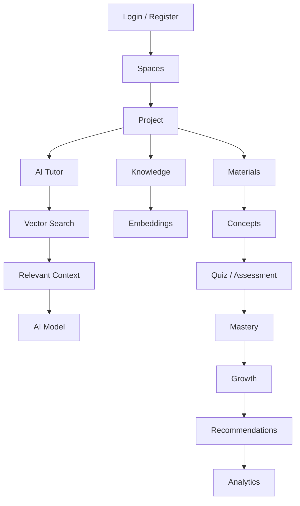
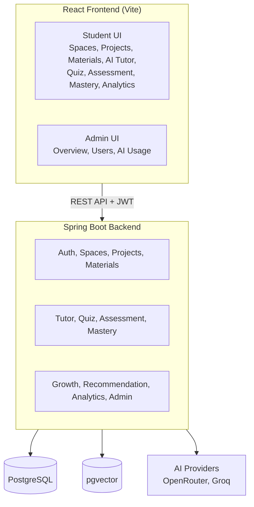
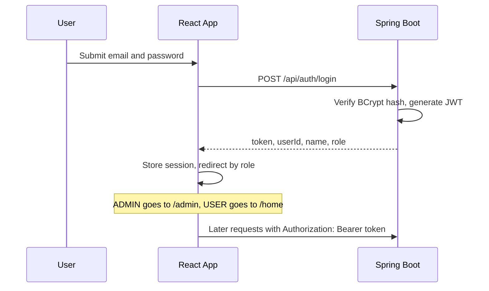
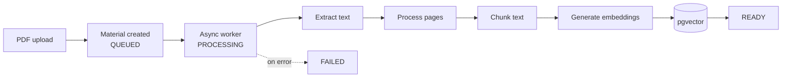
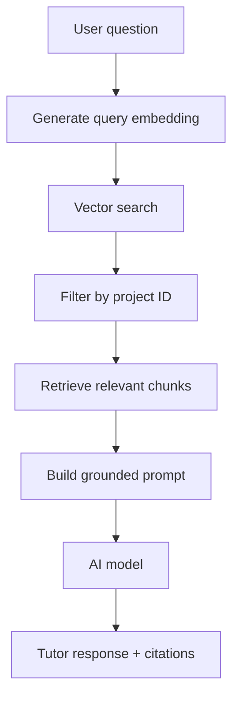
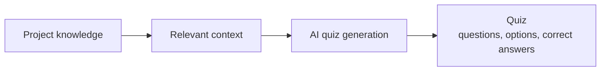

<div align="center">

# AI Study Companion

**Upload your study material, learn through a grounded AI tutor, practice with quizzes, and track mastery over time.**


</div>

---

AI Study Companion is a full-stack learning platform that turns a student's own PDFs into an interactive, personalized study experience. It combines **document processing, project-scoped RAG, an AI tutor, quiz generation, assessments, concept mastery, learning analytics, recommendations, and AI usage monitoring** in one application.

<!--
SCREENSHOTS: add images to docs/screenshots/ (for example home.png, admin-dashboard.png),
then uncomment this block.

## Screenshots

| Student Home | Admin Dashboard |
|---|---|
|  |  |
-->

## Table of Contents

- [Why This Project](#why-this-project)
- [Key Features](#key-features)
- [Application Workflow](#application-workflow)
- [Architecture](#architecture)
- [Technology Stack](#technology-stack)
- [Quick Start](#quick-start)
- [Authentication and Authorization](#authentication-and-authorization)
- [RAG Pipeline](#rag-pipeline)
- [AI Tutor](#ai-tutor)
- [Quiz and Assessment](#quiz-and-assessment)
- [Mastery and Growth](#mastery-and-growth)
- [Analytics and Recommendations](#analytics-and-recommendations)
- [Admin Dashboard](#admin-dashboard)
- [API Reference](#api-reference)
- [Database](#database)
- [Configuration](#configuration)
- [Running the Backend](#running-the-backend)
- [Running the Frontend](#running-the-frontend)
- [Environment Variables](#environment-variables)
- [Project Structure](#project-structure)
- [Security](#security)
- [Design Principles](#design-principles)
- [Future Improvements](#future-improvements)
- [Author](#author)

---

## Why This Project

A general-purpose chatbot can answer outside the student's material, with no way to tell what came from their notes and what the model made up. This platform is built around a different idea:

> **Upload your study material → build a knowledge base → learn through AI → practice → measure mastery → improve.**

Each project has its own study materials and knowledge context. When a student asks the AI Tutor a question, relevant chunks are retrieved from **that project's** vector store and supplied to the model as context, with source and page citations in the answer.

### What it demonstrates

- **Project-scoped RAG** with PostgreSQL + pgvector, so one project's material never leaks into another
- **Asynchronous document pipeline**: PDF extraction, page-aware chunking, embeddings, and status tracking
- **JWT authentication with role-based access control**, enforced on the backend and mirrored in the frontend
- **AI observability**: every AI call is recorded with model, tokens, and estimated cost
- **Modular monolith** backend organized by domain

---

## Key Features

### Learning

| Area | Capabilities |
|---|---|
| Organization | Spaces for grouping learning projects, projects for individual subjects or topics |
| Materials | PDF upload, asynchronous processing, text extraction, page-aware chunking |
| Retrieval | Vector embeddings, pgvector storage, project-scoped semantic search |
| AI Tutor | Answers grounded in uploaded material, source and page citations, clear handling of questions outside the material |
| Practice | AI-generated quizzes, answer submission, completion tracking |
| Assessment | AI-assisted answer evaluation feeding into mastery |
| Progress | Concept extraction, concept mastery, growth classification, project analytics, personalized recommendations |

### Platform

- User registration and login
- JWT-based stateless authentication
- Role-based authorization (`USER`, `ADMIN`)

### Admin

- Admin-only dashboard with platform overview
- User list, per-user activity and project inspection, project details
- AI usage summary, model-wise usage, token tracking, estimated cost

---

## Application Workflow



---

## Architecture

The backend is a **modular monolith**: one deployable Spring Boot application, organized into domain modules.



---

## Technology Stack

### Backend

| Technology | Purpose |
|---|---|
| Java 21 | Backend language |
| Spring Boot 4.1.1 | Application framework |
| Spring Web MVC | REST APIs |
| Spring Data JPA | Persistence |
| Spring Security + JWT | Stateless authentication and authorization |
| Bean Validation | Request validation |
| Spring AI 2.0.1 | AI model integration |
| PostgreSQL + pgvector | Relational data and vector similarity search |
| Apache PDFBox 3.0.5 | PDF text extraction |
| Lombok | Boilerplate reduction |
| Maven | Build and dependency management |

### Frontend

| Technology | Purpose |
|---|---|
| React 19 | UI |
| Vite | Tooling and dev server |
| React Router | Client-side routing |
| Axios | API communication |
| CSS | Styling |

### AI

| Component | Used for |
|---|---|
| OpenRouter | Gateway to chat and embedding models |
| Google Gemini 2.5 Flash | Chat model (tutor, quiz, assessment) |
| OpenAI `text-embedding-3-small` | Embeddings (1536 dimensions) |
| Groq | Selected AI processing |
| Spring AI + pgvector | Model integration and vector store |

---

## Quick Start

```bash
# 1. Database
createdb study_companion
psql study_companion -c "CREATE EXTENSION IF NOT EXISTS vector;"

# 2. Backend (set the environment variables first, see "Environment Variables")
git clone <YOUR_BACKEND_REPOSITORY_URL>
cd ai-study-companion
mvn spring-boot:run

# 3. Frontend (new terminal)
git clone <YOUR_FRONTEND_REPOSITORY_URL>
cd ai-study-companion-frontend
npm install
npm run dev
```

| Service | URL |
|---|---|
| Frontend | http://localhost:5173 |
| Backend | http://localhost:8080 |
| Health check | http://localhost:8080/actuator/health |

Full setup details are in [Running the Backend](#running-the-backend) and [Running the Frontend](#running-the-frontend).

---

## Authentication and Authorization

The application uses **JWT-based stateless authentication** with two roles: `USER` and `ADMIN`.



- The frontend stores the token and attaches it to every request through an Axios interceptor.
- After login, the user is redirected by role: admins land on the admin dashboard, everyone else on the student home.
- A `ProtectedRoute` component guards frontend routes. The `/admin` route requires the `ADMIN` role.
- **The frontend guard is a UX convenience. Access is enforced on the backend:**

```java
.requestMatchers("/api/admin/**").hasRole("ADMIN")
```

---

## RAG Pipeline

### Document processing

When a user uploads a PDF, it is processed asynchronously so the upload request returns immediately.



Material states: `QUEUED`, `PROCESSING`, `READY`, `FAILED`.

Each stored chunk carries metadata used for project isolation and citations:

- Project ID
- Material ID
- File name
- Page number

### Project-scoped retrieval

A major design decision is **project-level data isolation**. When a student asks a question, the system does not search the whole database:



This prevents material from one project from becoming context for another.

---

## AI Tutor

The AI Tutor answers questions using the student's own study material. For each request it receives:

- The current question
- Retrieved study material
- Conversation history

The prompt instructs the model to stay grounded in the provided context. Responses can include citations with the source file, page number, and the relevant passage.

If the required information is not in the project's material, the tutor says the answer cannot be grounded in the available material instead of presenting unrelated information as if it came from the student's documents.

---

## Quiz and Assessment

### Quiz generation



Supported operations: quiz generation, quiz retrieval, answer submission, and completion tracking.

### Assessment

The assessment system evaluates submitted answers with the AI model and stores the results for later mastery calculations.

---

## Mastery and Growth

The application tracks performance at the **concept** level.

### Mastery calculation

For the first calculation:

```text
Mastery = Current Performance
```

For every later update, an exponentially weighted average is used:

```text
New Mastery = (Old Mastery × 0.70) + (Current Performance × 0.30)
```

This keeps scores stable instead of replacing the history after every assessment. For example, with an old mastery of 60% and a new performance of 80%: `60 × 0.70 + 80 × 0.30 = 66%`.

### Growth classification

| Mastery | Classification |
|---|---|
| 70% or higher | `STRONG` |
| 40% to 69% | `DEVELOPING` |
| Below 40% | `NEEDS_ATTENTION` |

This classification drives progress views and recommendations.

---

## Analytics and Recommendations

The platform records learning events and provides project-level analytics, including:

- Learning activity
- Quiz progress
- Assessment performance
- Mastery information
- Overall project progress

The recommendation module uses the learner's current state to point out areas that deserve additional attention.

---

## Admin Dashboard

The admin dashboard is part of the same React application, under the `/admin` route with its own layout and navigation. It shares the visual design system with the student experience but provides monitoring functionality only.

```text
Admin
├── Overview
├── Users
└── AI Usage
```

**Overview** shows platform-level statistics such as users, spaces, projects, and learning events.

**Users** lets administrators inspect users, their activity, and their projects.

**AI Usage** is backed by a record of every AI call:

| Recorded per call | Shown on the dashboard |
|---|---|
| Provider | Total AI requests |
| Model | Total input, output, and combined tokens |
| Operation | Estimated cost |
| Input / output / total tokens | Model-wise usage breakdown |
| Estimated cost | |
| User ID, timestamp | |

---

## API Reference

All endpoints are prefixed with `/api` unless noted. **Auth** indicates what the caller needs: `Public`, `JWT` (any signed-in user), or `ADMIN`.

### Authentication

| Method | Endpoint | Auth |
|---|---|---|
| `POST` | `/api/auth/register` | Public |
| `POST` | `/api/auth/login` | Public |

### Spaces

| Method | Endpoint | Auth |
|---|---|---|
| `POST` | `/api/spaces` | JWT |
| `GET` | `/api/spaces` | JWT |
| `GET` | `/api/spaces/{spaceId}` | JWT |
| `DELETE` | `/api/spaces/{spaceId}` | JWT |

### Projects

| Method | Endpoint | Auth |
|---|---|---|
| `POST` | `/api/spaces/{spaceId}/projects` | JWT |
| `GET` | `/api/spaces/{spaceId}/projects` | JWT |
| `GET` | `/api/projects/{projectId}` | JWT |
| `DELETE` | `/api/projects/{projectId}` | JWT |

### Materials

| Method | Endpoint | Auth |
|---|---|---|
| `POST` | `/api/projects/{projectId}/materials` | JWT |
| `GET` | `/api/projects/{projectId}/materials` | JWT |
| `DELETE` | `/api/projects/{projectId}/materials/{materialId}` | JWT |

The upload endpoint accepts `multipart/form-data` for PDF files.

### AI

| Method | Endpoint | Auth |
|---|---|---|
| `POST` | `/api/ai/chat` | JWT |
| `GET` | `/api/ai/search` | JWT |
| `POST` | `/api/ai/tutor` | JWT |
| `POST` | `/api/ai/concepts/extract` | JWT |
| `POST` | `/api/ai/quiz/generate` | JWT |
| `GET` | `/api/ai/quiz/{quizId}` | JWT |
| `POST` | `/api/ai/quiz/{quizId}/answer` | JWT |
| `GET` | `/api/ai/growth` | JWT |
| `POST` | `/api/ai/recommendation` | JWT |

### Assessment, Analytics, Growth

| Method | Endpoint | Auth |
|---|---|---|
| `POST` | `/api/assessments` | JWT |
| `GET` | `/api/analytics/project` | JWT |
| `GET` | `/api/growth/project` | JWT |

### Admin

| Method | Endpoint | Auth |
|---|---|---|
| `GET` | `/api/admin/overview` | ADMIN |
| `GET` | `/api/admin/users` | ADMIN |
| `GET` | `/api/admin/users/{userId}/activity` | ADMIN |
| `GET` | `/api/admin/users/{userId}/projects` | ADMIN |
| `GET` | `/api/admin/projects/{projectId}` | ADMIN |
| `GET` | `/api/admin/ai/usage` | ADMIN |
| `GET` | `/api/admin/ai/models` | ADMIN |

### Health

| Method | Endpoint | Auth |
|---|---|---|
| `GET` | `/actuator/health` | Public |

---

## Database

PostgreSQL is the primary database, with the pgvector extension for semantic search.

Major domain areas:

```text
Users               Concepts            Recommendations
Spaces              Concept Mastery     Learning Events
Projects            Quizzes             AI Usage
Materials           Quiz Answers
Document Chunks     Assessments
Conversations
Messages
```

Vector store settings:

| Setting | Value |
|---|---|
| Embedding model | `openai/text-embedding-3-small` |
| Dimensions | 1536 |
| Distance | `COSINE_DISTANCE` |
| Index | HNSW |

---

## Configuration

Configuration is driven by environment variables, with sensible defaults for local development.

```yaml
spring:
  ai:
    model:
      chat: openai
      embedding:
        text: openai

    openai:
      api-key: ${OPENROUTER_API_KEY}
      base-url: ${OPENROUTER_BASE_URL:https://openrouter.ai/api/v1}

      chat:
        model: ${AI_CHAT_MODEL:google/gemini-2.5-flash}
        temperature: ${AI_TEMPERATURE:0.3}
        max-tokens: ${AI_MAX_TOKENS:1000}

      embedding:
        model: ${AI_EMBEDDING_MODEL:openai/text-embedding-3-small}
        dimensions: 1536

  datasource:
    url: ${DATABASE_URL:jdbc:postgresql://localhost:5432/study_companion}
    username: ${DATABASE_USERNAME:postgres}
    password: ${DATABASE_PASSWORD}

jwt:
  secret: ${JWT_SECRET}
  expiration: ${JWT_EXPIRATION:86400000}

server:
  port: ${SERVER_PORT:8080}
```

---

## Running the Backend

### Prerequisites

- Java 21
- Maven
- PostgreSQL with the pgvector extension
- An OpenRouter API key
- A Groq API key, if using the Groq-backed functionality

### Steps

**1. Clone the repository**

```bash
git clone <YOUR_BACKEND_REPOSITORY_URL>
cd ai-study-companion
```

**2. Create the database and enable pgvector**

```sql
CREATE DATABASE study_companion;
\c study_companion
CREATE EXTENSION IF NOT EXISTS vector;
```

**3. Set environment variables**

Use the values from [Environment Variables](#environment-variables). Never commit real API keys or JWT secrets.

**4. Build and run**

```bash
mvn clean package -DskipTests
mvn spring-boot:run
```

The backend starts on `http://localhost:8080`. Verify it with `http://localhost:8080/actuator/health`.

---

## Running the Frontend

### Prerequisites

- Node.js
- npm

### Steps

```bash
cd ai-study-companion-frontend
npm install
npm run dev
```

The app runs on `http://localhost:5173`. The Vite dev server proxies `/api` requests to `http://localhost:8080`, so start the backend first.

```bash
npm run build     # production build
npm run preview   # preview the production build
```

---

## Environment Variables

Recommended `.gitignore` entries:

```gitignore
.env
.env.*
!.env.example
```

`.env.example`:

```env
DATABASE_URL=jdbc:postgresql://localhost:5432/study_companion
DATABASE_USERNAME=postgres
DATABASE_PASSWORD=

OPENROUTER_API_KEY=
OPENROUTER_BASE_URL=https://openrouter.ai/api/v1

JWT_SECRET=
JWT_EXPIRATION=86400000

SERVER_PORT=8080

AI_CHAT_MODEL=google/gemini-2.5-flash
AI_EMBEDDING_MODEL=openai/text-embedding-3-small
AI_TEMPERATURE=0.3
AI_MAX_TOKENS=1000

SHOW_SQL=false
FORMAT_SQL=false
```

| Variable | Description |
|---|---|
| `DATABASE_URL`, `DATABASE_USERNAME`, `DATABASE_PASSWORD` | PostgreSQL connection |
| `OPENROUTER_API_KEY`, `OPENROUTER_BASE_URL` | AI gateway credentials and endpoint |
| `JWT_SECRET` | Signing secret, use a long random value (at least 32 characters) |
| `JWT_EXPIRATION` | Token lifetime in milliseconds (default 86400000, which is 24 hours) |
| `AI_CHAT_MODEL`, `AI_EMBEDDING_MODEL` | Model identifiers |
| `AI_TEMPERATURE`, `AI_MAX_TOKENS` | Generation settings |
| `SHOW_SQL`, `FORMAT_SQL` | SQL logging for debugging |

> **Note:** Spring Boot does not load `.env` files on its own. Export the variables in your shell, set them in your IDE run configuration, or use a helper such as `spring-dotenv`.

---

## Project Structure

### Backend

```text
src/main/java/com/studycompanion
├── admin            controller, dto, service
├── ai               controller, config, service
│                    (TutorService, VectorSearchService, VectorStoreService, TutorResponse)
├── analytics
├── assessment
├── auth             controller, dto, security, service
├── concept
├── growth
├── material         controller, dto, entity, processing, repository, service
├── project
├── quiz
├── recommendation
├── space
├── tutor
└── user
```

### Frontend

```text
src
├── assets
├── components
│   └── ProtectedRoute.jsx
├── context
│   └── AuthContext.jsx
├── pages
│   ├── Landing, Login, Register, Home
│   ├── Spaces, Projects, ProjectWorkspace
│   ├── Materials, Knowledge, AITutor
│   ├── Quiz, Assessment, Mastery, Growth, ProjectAnalytics
│   └── AdminDashboard
├── services
│   ├── api.js               Axios instance and interceptors
│   ├── authService.js
│   ├── spaceService.js
│   ├── projectService.js
│   ├── materialService.js
│   ├── tutorService.js
│   ├── analyticsService.js
│   └── adminService.js
├── utils
│   └── roles.js             role normalization and post-login redirect
├── App.jsx
└── main.jsx
```

---

## Security

| Layer | Implementation |
|---|---|
| Passwords | Hashed with BCrypt |
| Authentication | JWT sent as `Authorization: Bearer <token>` |
| Sessions | Stateless (`SessionCreationPolicy.STATELESS`) |
| Authorization | `/api/admin/**` requires `ROLE_ADMIN` on the backend; the frontend also guards `/admin` for UX |
| Data isolation | Vector search is scoped by project ID |
| Validation | Jakarta Bean Validation on request DTOs |
| Errors | Global exception handler with consistent API error responses |

---

## Design Principles

1. **Ground AI responses in the student's material.** The tutor uses retrieved project content rather than treating general model knowledge as the student's knowledge base.
2. **Isolate project knowledge.** Each project maintains its own learning context.
3. **Separate learning from administration.** Students get a learning-focused interface; administrators get a lightweight monitoring dashboard.
4. **Keep AI usage observable.** Requests are recorded with model and token information so usage and estimated cost can be monitored.
5. **Stay modular without over-splitting.** The backend is a modular monolith rather than prematurely split into microservices.

---

## Future Improvements

**Quality and operations**
- Automated backend and frontend test coverage
- Docker Compose setup for one-command local startup
- Rate limiting and Redis caching
- Cloud and Kubernetes deployment

**AI**
- Streaming tutor responses
- More embedding and model providers
- Improved recommendation algorithms
- More assessment types
- More detailed cost tracking for every AI operation

**Product**
- Usage trends and historical charts in the admin dashboard
- Notifications and reminders
- Collaborative study spaces

---

## Author

**Rajesh**, B.Tech Computer Science and Engineering

Interested in backend development, Java, Spring Boot, AI/LLM applications, RAG systems, microservices, DevOps, and cloud technologies.

- GitHub: [github.com/your-username](https://github.com/your-username)
- LinkedIn: [linkedin.com/in/your-profile](https://linkedin.com/in/your-profile)

---

## License

This project is developed for educational and portfolio purposes.
